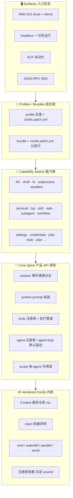
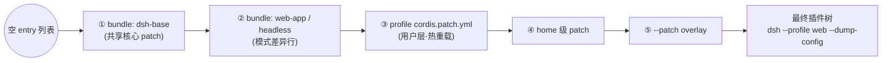
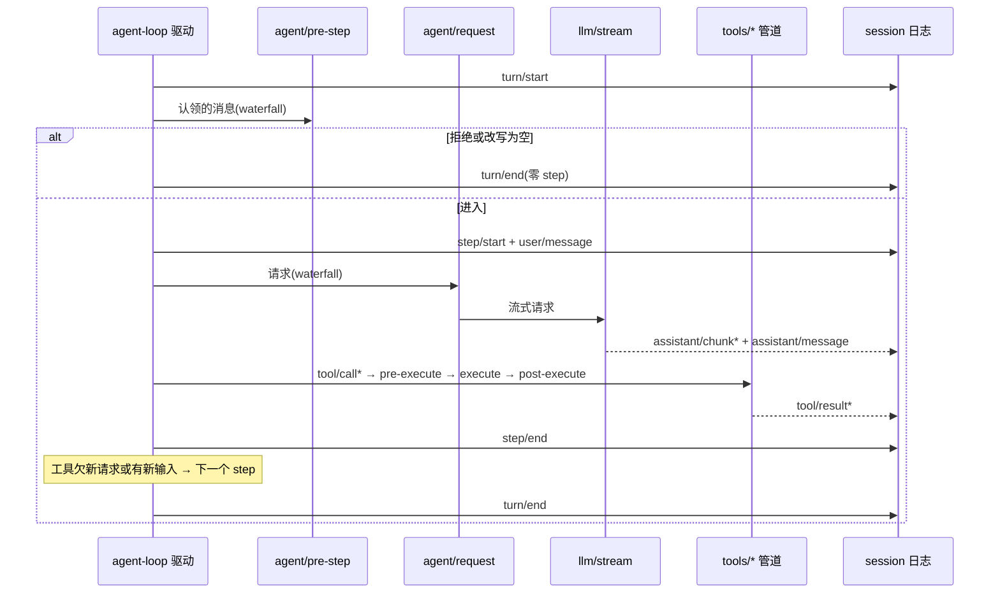
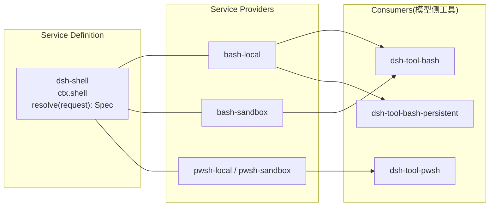

# DeepSeek Harness (DSH) 系统架构图集

以图为主理解 DSH:一个构建在 vendored Cordis 插件框架之上的 agent harness,**产品没有任何特权核心** —— 模型适配器、工具注册表、会话日志、甚至 agent loop 本身都是配置里可替换的插件行。

> 配套交互式版本:``architecture.html``(同一目录,浏览器直接打开,纯静态、零外部依赖)。

---

## 1. 分层总览

```
┌─────────────────────────────────────────────────────────────────┐
│                     Surfaces 入口形态                             │
│   Web GUI(host+client) · headless 一次性 · ACP · JSON-RPC SDK   │
├─────────────────────────────────────────────────────────────────┤
│                   Profiles / Bundles 组合层                       │
│   profile = $DSH_HOME/profiles/<name>/(bundles 列表 + 用户 patch) │
│   bundle  = cordis.patch.yml 分发行(dsh-base/web-app/headless)  │
│   叠加:空表 → 各 bundle → profile patch → home patch → --patch    │
├─────────────────────────────────────────────────────────────────┤
│                  Capability Seams 能力缝(三角色)                 │
│   llm · shell · fs · subprocess · sandbox · terminal · lsp      │
│   skill · web · subagent · workflow · settings · credentials …  │
│   每条缝 = Service Definition + Provider + Consumer(常是工具)   │
├─────────────────────────────────────────────────────────────────┤
│                     Core Spine 产品 API 脊柱                      │
│   session(事件溯源日志) · system-prompt · tools(注册表+管道)   │
│   agent(存活注册表) · agent-loop(默认驱动) · scope(作用域)   │
├─────────────────────────────────────────────────────────────────┤
│                     Vendored Cordis 内核原语                      │
│   Context 服务仓库 · inject 依赖 · 四种事件分发 · Loader         │
│   ctx.effect / ctx.on 注册即效果,卸载时反向 unwind              │
└─────────────────────────────────────────────────────────────────┘
```

**Mermaid 版:**



### 核心脊柱与 ctx key 对照

| 包 | ctx key | 职责 |
|---|---|---|
| ``core/session`` | ``ctx.sessions`` | append-only ``SessionEvent`` 日志 + 内存 store;``deriveMessages()`` 投影模型历史;持久化是插件自己的事 |
| ``core/system-prompt`` | ``ctx.systemPrompt`` | prompt section 与工具 schema 组装 |
| ``core/tools`` | ``ctx.tools`` | 作用域工具注册表 + 受守卫执行管道 |
| ``core/agent`` | ``ctx.agents`` | ``Agent`` 接口、存活注册表、``agent/*`` 事件、initiator 作用域 |
| ``core/agent-loop`` | ``ctx.agentLoop`` | 默认驱动(``ReactLoopAgent``),本身可替换 |
| ``core/scope`` | (库,无 key) | scope 链:注册视图向下继承,事件分发向上放行 |
| ``llm/llm`` | ``ctx.llm`` | 消息与流式词汇表 + 适配器缝 |

---

## 2. Everything is Plugin:组合机制

**最有说服力的证据** —— ``packages/bundle/base/cordis.patch.yml`` 里,最核心的东西也只是普通行:

```yaml
- id: session      # 会话日志是插件
  name: '@deepseek-ai/dsh-session'
- id: tools        # 工具注册表是插件
  name: '@deepseek-ai/dsh-tools'
- id: agent-loop   # agent loop 本身是插件
  name: '@deepseek-ai/dsh-agent-loop'
  config:
    agents: []     # 启动时创建哪些 agent 也是配置
- id: llm-deepseek # 模型适配器是插件
  name: '@deepseek-ai/dsh-llm-deepseek'
```

### Patch 层叠加顺序

```
空 entry 列表
   │
   ▼ ①按 dsh.profile.bundles 列出的顺序
┌──────────────────────── dsh-base ────────────────────────┐
│ 模型适配器 · 工具 · 持久化 · sandbox · 审批 · settings    │
│ credentials · telemetry · subagent · workflow …           │
└───────────────────────────────────────────────────────────┘
   │
   ▼ ②模式 bundle(web-app 加浏览器应用 / headless 加一次性 runner)
┌──────────────── dsh-web-app / dsh-headless ───────────────┐
│ 只重声明与 base 不同的行(整行替换,不合并)               │
└───────────────────────────────────────────────────────────┘
   │
   ▼ ③profile 自己的 cordis.patch.yml(用户层,热重载)
   ▼ ④home 级 patch
   ▼ ⑤--patch 命令行 overlay
   │
┌─────────────────── 最终插件树(可 dump 验证)──────────────┐
│ dsh --profile web --dump-config                            │
└───────────────────────────────────────────────────────────┘
```



关键规则:

- **整行替换,不合并**:patch 按 id 定位一行并替换其整个 ``config``;按模式不同的值放到各模式 bundle,一行只出现在一个 bundle 层 + 用户层。
- **行序无语义**:激活由服务可用性(inject)驱动,不是顺序驱动。
- **``!!js`` 做环境选择**:``disabled: !!js process.platform === 'win32'``(bash/pwsh 互斥挂载)、``mode: !!js process.env.DSH_PERMISSION_MODE ?? 'workspace-write'``。
- **想换掉任何东西**:写一个 patch 按 id 覆盖那行即可,没有特权核心需要 fork。

---

## 3. Turn / Step 生命周期(agent-loop)

一个 **step** = 一次模型请求 + 它调用的工具;一个 **turn** = 零或多个 step:第一个输入被认领前开,不再欠任何东西时关。

```
turn/start(持久事件)
  │ 认领 inbox 输入 + 排队消息;组装 prompt sections + 工具 schema
  ▼
agent/pre-step ──── waterfall:可改写认领的消息,或直接拒绝
  │  拒绝 / 首次改写为空 → 零 step 关闭 turn(日志仍记录这次尝试)
  ▼
step/start → user/message 落日志
  │ 从日志派生模型历史
  ▼
agent/request(waterfall)→ llm/stream ─→ assistant/chunk* ─→ assistant/message
  │
  ▼
tool/call* → tools/pre-execute → tools/execute → tools/post-execute(均 waterfall)
  │                                                          │
  ▼                                                          ▼
tool/result*                                            step/end
  │
  ├─ 工具欠另一个请求,或有新输入到达 → 认领 → 下一个 step
  ▼
agent/turn-stopping(serial,无 next,可停 turn)
  │
  ▼
turn/end(持久事件)
```



- ``turn/*``、``step/*``、``user/message``、``assistant/*``、``tool/*`` 是**持久会话事件**;其余是跨三个域的**存活扩展点**。
- ``agent/pre-step``、``agent/request``、``llm/stream``、三个 ``tools/*`` 是 **waterfall**,监听器必须调 ``next()`` 委托;``agent/turn-stopping`` 是 **serial** 且无 ``next()``。
- 输入通过**一个 inbox** 到达驱动器:有些消息立即唤醒,注入的上下文在 inbox 里等下一条消息。
- ``agent/pre-step`` 决定模型看到什么;每个 step 读取插件注册的 prompt sections 与工具 schema。

---

## 4. Capability Seam 三角色

一条**能力缝** = 可替换的能力,固定由三个角色构成:

```
┌──────────────────────┐   声明接口    ┌──────────────────────┐
│  Service Definition   │              │   Service Provider    │
│ (声明 ctx.shell 接口  │◄────────────│ (bash-local / pwsh…  │
│  + resolve(r): Spec) │   实现 it     │  实现 it)             │
└──────────┬───────────┘              └──────────┬───────────┘
           │ 使用                                 │ 被使用
           ▼                                     │
┌──────────────────────┐                         │
│      Consumer         │◄────────────────────────┘
│ (面向模型的 tool,如   │
│  dsh-tool-bash)       │
└──────────────────────┘
```

- 一个包可以合并多个角色,但**只有一个角色不构成缝**;加新能力 = 三角色一起设计。
- **显式 ``resolve(request): Spec``**:默认值是 owning 实现里显式的解析步骤,不是 ``run()`` 里隐藏的 ``?? default``(dsh-shell 是模板)。
- **扩展插件依赖 Service Definition,永不依赖具体 Provider** —— 这是 ``dsh-agent-loop`` 可换、UI/hook/工具只用 ``dsh-agent`` 的原因。

### 以 shell 家族为例(packages/shell/)



### 一个 Provider 换,全家搬

fs / subprocess / sandbox 共享同一个执行世界:

```
                     ┌── 换 provider 指向 ──┐
                     │   远程沙箱(E2B POC) │
                     ▼                      │
┌──────────────┐  ┌──────────────────────────┴─┐
│ ctx.sandbox  │  │ ctx.fs + ctx.subprocess     │
│ bwrap/       │  │ 共享一个执行世界             │
│ Landlock/    │  └──────┬───────────┬──────────┘
│ Seatbelt     │         ▼           ▼
└──────────────┘   Bash 工具      PTY / LSP
                   一起跟着走,零 provider 分叉
```

同构三角色家族:``web/``(seam + search/fetch providers + web 工具)、``skill/``(注册表 + 文件 provider + catalog/loader 工具)、``subagent/``(spawn/fork in-process providers + 委托工具)、``workflow/``(worker-thread 引擎 + workflow/ralph 工具)、``settings/``、``credentials/``。

---

## 5. Cordis 事件分发模式

| 模式 | 是否 await | 顺序 | 返回值 | 用途 |
|---|---|---|---|---|
| ``emit`` | 否 | 注册顺序观察 | 无 | 观察事实(如 ``session/event``) |
| ``waterfall`` | 否 | 注册顺序 | **有** | around 中间件,**必须调 ``next()``** 否则短路 |
| ``parallel`` | 是 | 并行 | 无 | 扇出 |
| ``serial`` | 是 | 注册顺序 | 有 | 有序决策(``agent/turn-stopping``) |

三个事件域:

- **Session 事件**:持久事实,append 进日志并经 ``session/event`` 广播。事实必须在 reload 后存活 → 用它。
- **Agent 事件**(``agent/*``):携带存活 ``Agent``:inbox、step、状态、请求、校验、续跑。观察/拦截进行中的工作 → 用它。
- **Capability 事件**:把策略和适配器挂到缝上(``fs/*``、``tools/*``、``telemetry/*``),无需 import loop。

---

## 6. Session 日志:事件溯源

**Model-visible ⟺ logged**:任何到达模型请求的内容必须能从日志重建(有运行时断言)。新增模型可见输入 = 新增一个 session 事件。

```
                      ┌────────────────────────┐
   agent-loop append  │   append-only 日志     │  turn/* step/* user/message
  ──────────────────► │  (SessionEvent 流)     │  assistant/* tool/* …
                      └───────────┬────────────┘
                                  │ 单一权威源
        ┌─────────────┬───────────┼─────────────┬──────────────┐
        ▼             ▼           ▼             ▼              ▼
  deriveMessages  UI/transcript  持久化插件    fork/resume   telemetry
  (投影模型历史)    渲染          (订阅           (从流派生)     (从流派生)
                                  session/event)
```

- 原始 ``assistant/chunk`` 事件保留,保证 replay 与 UI 保真。
- fork:``ctx.sessions.fork(source, boundary?, childSessionId?)``。
- 事件用 TS 声明合并扩展 ``SessionEventMap``;required-on-read 默认,``ignorable: true`` 例外。

---

## 7. 行为该加在哪(扩展点速查)

| 目标 | 机制 |
|---|---|
| 加模型 provider | 在 ``ctx.llm`` 上注册适配器 |
| 加模型可见能力 | 注册到 ``ctx.tools``;schema 自动进 prompt 组装 |
| 给某会话不同能力集 | 组 agent preset;service 行需 ``isolate`` realm |
| 拦截请求/工具/turn | 用 ``agent/*`` 或 ``tools/*`` 事件;``agent/turn-stopping`` 停 turn |
| 加模型可见上下文 | ``agent.inject()``,落在下一个被接纳的请求 |
| 加人类命令 | 注册 ``ctx.commands``,不经模型 turn 直接分发 |
| 加后台工作 | 注册 ``ctx.jobs``;``job_*`` 工具收集/停止 |
| 加持久会话状态 | 扩展 ``SessionEventMap``;从日志渲染和 replay |
| 限定注册到单个 agent | 用那个 agent 的 ``agent.ctx`` |
| 让 agent 自我改造 | ``extensions/``:实时检查/挂载/卸载插件 |

---

*依据:``docs/architecture.md``、``docs/cordis-primer.md``、``packages/bundle/base/cordis.patch.yml``、``packages/core/agent-loop/src/agent.ts``、``packages/boot/app-boot/src/profile.ts``、``packages/core/scope/src/index.ts``。*
